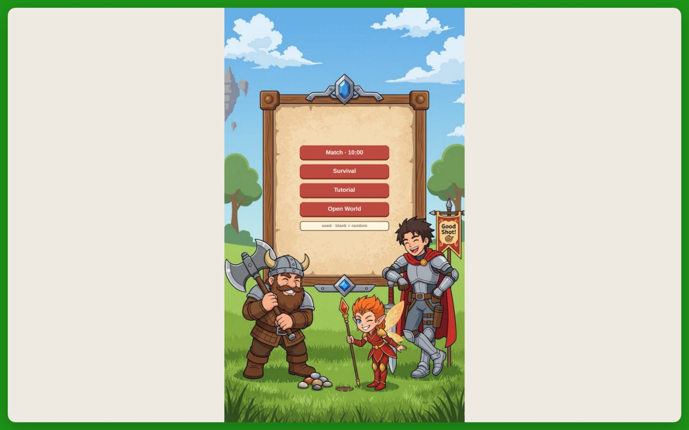
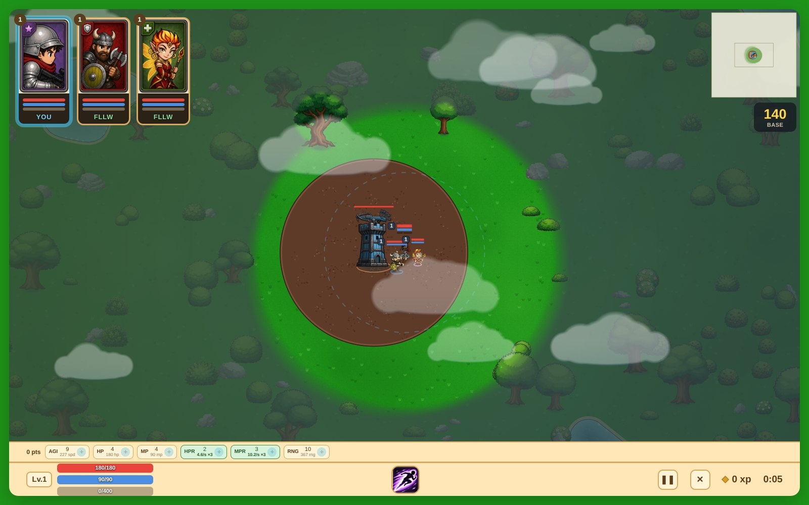
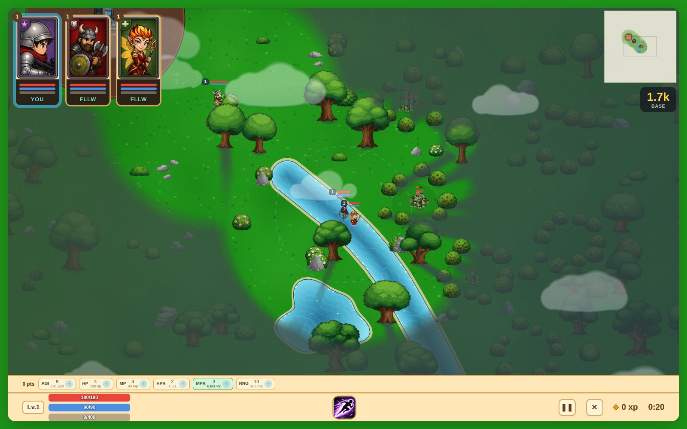
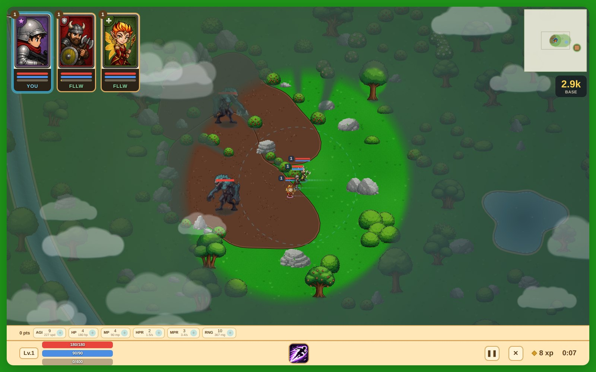
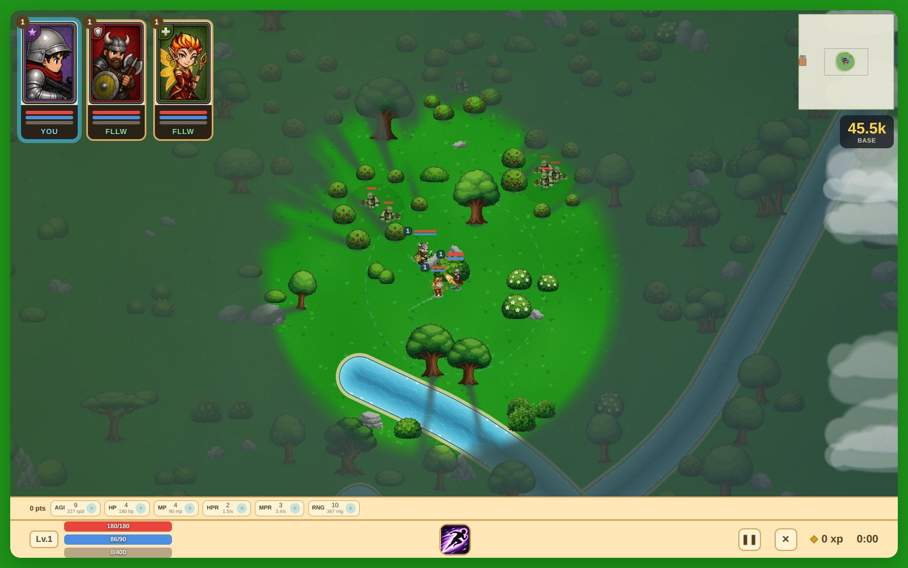
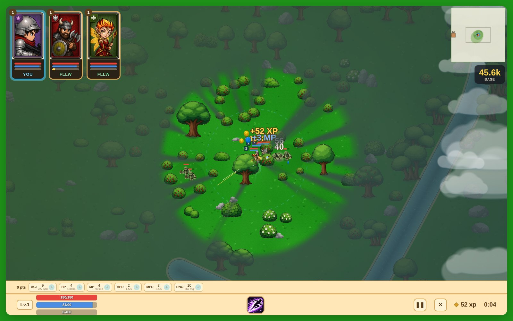
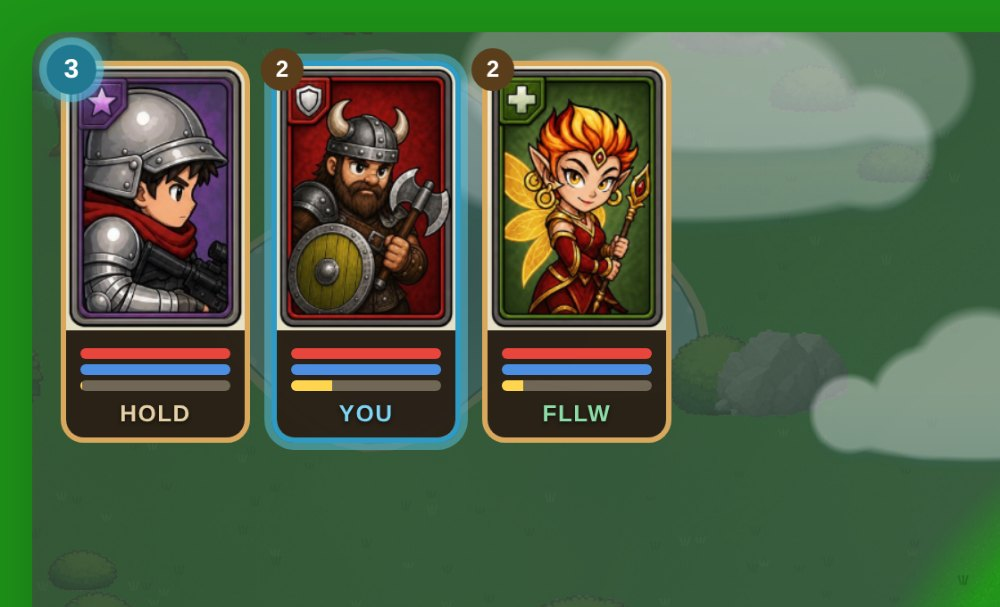
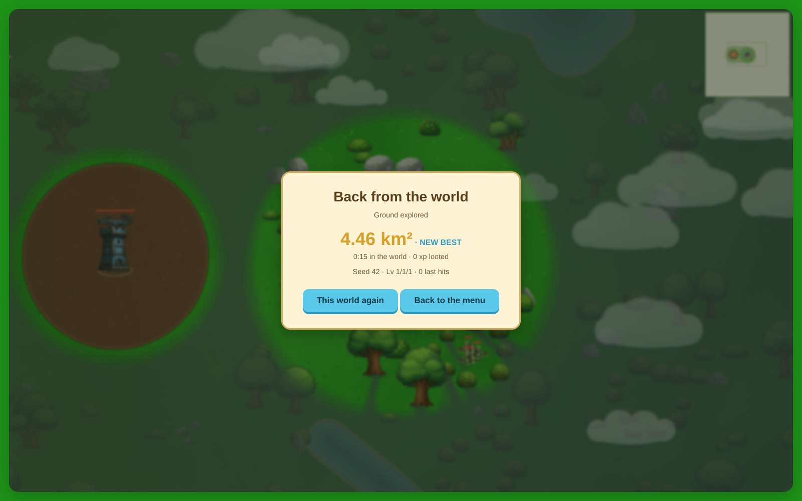

# Gameplay screenshots

Frames from one full 10-minute Match, one Survival round and a walk through
the Open World. The match and the arena were played in a
headless Chromium against the shipped `index.html` (build v154). The hero you
control was driven by a small autopilot that walks its lane, trades with
creeps, focuses enemy heroes, uses its skill and backs off when low, and the
camera followed whichever of the three heroes was closest to the enemy team.
A frame was kept whenever something happened worth keeping: a kill, a hero
under 30% health with enemies on him, a building about to fall, a skill going
off inside a fight.

The match went the way [FINDINGS.md](FINDINGS.md) says it usually does. The
enemy team grouped, took our outposts one by one, and won on points with our base
at 9%. That is the state of the game, and these are honest frames of it.

Captured at 1600×1000 with the camera zoomed in to 1.4× (the desktop default
is 2×, which makes a fight the size of a thumbnail) so the action reads at
README scale.

The Open World frames further down were taken later, against the build that
ships today, and driven by hand rather than by an autopilot — that section says
how.

---

## The match

### First blood — 9:17

Every hero on both sides at level 1, nose to nose in the middle of the top
lane between the two outposts. Our tank (controlled, 424/450) puts a rocket
into the pile: **BOOM**, two **CRITICAL**s, and a **KILL! +30**. The XP orbs
from the fight are already scattering down the lane on the left.

### One second later

The enemy support answers with a heal wave (**+80** on all three of theirs),
and our carry is already down: his chip in the top-left corner is greyed out.
The trade ends 0–38 in points. This is the whole early game in one frame.

### The carry gets one back — 7:27

An enemy hero who has just popped two levels on the orbs from the last
fight (**Lv.7 UP! Lv.8 UP!**) is caught on the river bank in front of our base
tower and dies there: **KILL! +30**. Our carry, back from respawn at level 1,
is the one shooting from the tower steps on the left. Two more enemy heroes
are already turning toward him from the top and bottom of the frame.

### Tank at 85 of 450, three on one — 7:02

The tank is in the open below our top outpost with all three enemy heroes
within reach. His health bar reads 85/450 in the HUD. He still lands a
**CRITICAL 228** on one of them before backing off toward the tower.

### Top outpost falls — 6:25

**+200** floats over the spot where our top outpost stood. Enemy creeps
stream past it, two enemy heroes stand in the wreckage, and our tank (mana at
8/70) has nothing left to throw at them. The red score is rolling past 800.

### Stand at the base tower — 5:47

The support (controlled) is pinned in under our base tower. A moment before
this frame he was at 11% health; an enemy hero dies at the foot of the turret
(**KILL! +30**) and his own heal wave has him back at 150/150 by the time the
frame lands. A level-11 enemy hero is still standing on the top lane above,
waiting for the next wave.

### The dash — 5:25

The carry dashes along the river straight through two enemy heroes. Damage
numbers stack over both of them and the dash after-image trails behind him
across the water.

### Two seconds later — 5:23

The price of the dash: 35 of 180 health, 8 mana, and the enemy hero is still
right there in the river. The autopilot pulls him back under the base tower on
the next tick. The red score has just crossed 1000.

### The surge — 3:10

Past the five-minute mark the waves stop being a trickle. Five big creeps and
ten small ones per lane per side pour down both lanes toward our base. The
tank's rocket bursts at the fork (**90** and **74** landing), the support
heals from behind the tower, and the enemy column for the bottom lane is still
arriving at the bottom of the frame. 471 to 1384.

### Late kill — 1:04

With a minute left and the score 959 to 1863, the tank (168/450) gets a
**KILL! +30** at the river mouth while two **+125** heals from our support
land on the squad. It changes nothing on the scoreboard, but it is the best
fight of the last two minutes.

### Defeat

Time ran out with both bases standing and the scoreboard settled it: 1169 to
2119, our base at 9%, theirs at 99%. 877 xp looted, 25 last hits.

---

## Survival

No enemy base: just our tower in the middle of the arena, mobs arriving in
growing numbers, and — from wave 4 — the enemy team walking in behind them.

### How a wave works

The round is counted in **waves**, not seconds. A wave marches, its number goes
up in the middle of the screen for a couple of seconds, and **nothing else
spawns until every mob of that wave is dead — and, from wave 4, every enemy
player in it too** — the HUD's right-hand slot reads
`Wave 7` where a Match reads a clock. So the pace is yours: meet a wave out on
the road and the next one is along in a moment; let the outposts grind it down
and you get a long breather to farm the camps with.

Each wave is bigger than the last — six mobs in wave 1, two more every wave
after, up to forty — and from wave 3 there is a big one in front, one more every
second wave. Past the size cap a wave stops getting wider and keeps getting
heavier: the big count goes on climbing under it. The whole wave shows on the
minimap, because a wave you have to clear is a wave you have to be able to find.

### The enemy team

The first three waves are mobs and mobs only. From wave 4 an enemy player joins
every third wave, and the banner says so under the number when one does:

| from wave | who | how they travel |
|---|---|---|
| 4 | the **tank** | with a mob pack, capped at a stride ahead of it — so it fights at the front of the wave instead of arriving alone |
| 7 | the **carry** | on the same road, sheltering behind the tank |
| 10 | the **healer** | shadowing the carry, and topping up whoever is hurt |
| 13 | all three | as one column, nobody outrunning the rearmost |

They arrive at that wave's level and gain as the waves do — a wave-4 tank is
about a level-4 player tank, and by wave 36 they are capped at 26. They push,
and only push: they walk their road to your tower and hit what stands on it,
they never farm a camp or chase you into the trees, and they hold outside an
outpost until their own wave is closer to it than they are.

**A lane's guns come down in order**, so the two outposts on a road are what
stands between an enemy player and your base: while one of them is up, your base
is not something that hero will attack at all. Mobs still walk past and chip it;
heroes do not. Hold your outposts and the thing being pushed is the outpost.

There is no respawn timer on them, and **the next wave will not march until
they are dead**: clearing the pack is only half of clearing a wave now, so a
hero you leave standing is a hero you are not being given a breather from. Kill
one and it is gone until the next wave brings it back, at that wave's level and
with full bars.

The last of them left alive goes **all in**. With its wave dead there is nothing
to shelter behind and nothing to wait for, so it stops holding outside your
outposts and walks into them — a wave always ends, and never by making you go
out and hunt a hero that has decided to wait in the trees. They are on the
minimap the whole time, drawn a size up from the mobs.

The end card reports the waves you held, with the clock and the loot under it.

### The frames below

These frames predate both the two-lane arena and the wave counter. The round was
played on the original map — four straight spokes, mobs arriving from all four
sides, waves on a shrinking timer — where today there are two snaking lanes, two
outposts on each, a river, six lakes and waves that wait to be cleared.

### Wave 23 — 2:06

Reached in two minutes, on the old timer. Under the wave counter, twenty-three
waves is a much longer and much heavier round. By wave 23 the mobs come faster
than the squad can burn them. The west outpost
(grey, in the sand circle) is already lost and swarmed, the east outpost is
being chewed on (**94** landing on it, lower centre), and the big mobs are
walking straight past the heroes toward the base.

### Overrun

2:07 survived, 23 waves held, 11 last hits. The tower behind the panel is
taking a **CRITICAL 169** as the screen fades.

---

## The open world

All of these are **seed 42**, so anyone can go and look at the same ground:
type `42` into the box under the menu board, or open
`index.html?seed=42`. They were driven with the keyboard — `tools/shoot.js`
and a short Playwright script, no reaching into the game's state — and where a
shot is of ground that is a real walk away, the caption says how it was
reached.

### The title screen, and the box

The fourth button, and under the board the seed box. Blank means a new world.
Every start empties it again, so two goes in a row are two different worlds and
only a number you typed repeats one.

### The plaza, five seconds in

The base tower and its plaza at the middle of the starting block, the squad
standing in it, and the whole panel still blank except the disc you can
actually see. The gold box on the right is distance from home, in units and
then in thousands; the clock beside it counts **up**, because out here nothing
is running out.

### 1.7k out, twenty seconds later

Walked east-south-east with the keys. A river with a lake hung off it, camp
mobs waiting on the far bank, and on the panel the trail behind us: ground
never visited is blank paper, ground we have been through is dimmed, and only
the disc around the squad is live. Nothing on this screen was in memory when
the round started — it was generated as we walked into it.

### A bowl, 2.9k west

Packed earth in the road palette, ragged rather than round, ringed with bush
and rock and left open in two places — and **two giants** inside it. They roam
in there and they stay in there: walk off and they turn back at the rim. Reached
with `?warp=400,1087` for the travel and then walked in from the east; the
minimap has already pinned the bowl at its rim.

### 45.5k out, where the camps are different

The same two camps you get at home, except the mobs in them are mediums —
880 hp against an easy mob's 70, and a leash long enough to walk out through
their own ring after a carry standing at max range. The chance of a camp
holding one rises with distance, from about 2% at the home ring to almost
every camp past 91,500. Reached with `?warp=47337,1700` and walked north into
the grove; the base marker is pinned at the left rim of the panel with the
distance on it.

Four seconds later, a medium is on the carry and the first one is down for
**+52 XP** — against the 400 a level costs out here, which is the arithmetic
the whole mode runs on.

### A hero who has been collecting and not spending

Nobody spends anybody's points — not the AI, not out here, not in a Match. And
an unspent level buys **nothing**: every stat is derived from what you bought,
so an ally at level 20 with 20 points in hand fights the way he did at level 1.
Orbs go to whoever is nearest, so out here that ally is easy to forget about.
So once a hero you are not driving is holding six points — two whole levels —
his level badge starts pulsing in the stat strip's own cyan. It is a reminder
and not a shortcut: you still switch to him and spend them yourself, and the
badge goes quiet the moment he is the one you are driving.

The carry below had been collecting for twenty minutes of open-world farming
while the tank was driven. Switching away from him is what lit it.

### Leaving

There is no end condition, so leaving is the end: pause, exit, and the round
goes through a session card instead of dropping you on the title screen. Ground
explored, time in the world, levels, xp looted and the seed — and **This world
again** next to the way out, because Play Again out here means that same world.

---

## How these were taken

The game's script was lifted out of `index.html` the same way `sim/harness.js`
does it, with one extra hook that exposes the live state (teams, creeps,
projectiles, towers, camera) to the page. A Playwright script then:

1. opened the page in headless Chromium at 1600×1000 and clicked **Match** or
   **Survival**;
2. ran an autopilot on every tick for the controlled hero, and switched to the
   hero nearest the enemy team whenever the current one had nothing to shoot;
3. polled the state a few times a second and saved a JPEG when a trigger
   fired: enemy hero killed in view, ally hero down in view, controlled hero
   under 30% with enemy heroes near, a building under 35% and being hit, a
   building destroyed, rocket splash or heal wave inside a fight, a dash on an
   enemy hero, or a very large number of creeps in view.

The simulation ran at 3× speed so a full match took about three and a half
minutes of wall time. About 140 frames were captured for the match and a dozen
for survival; the ones above are the pick of them.
